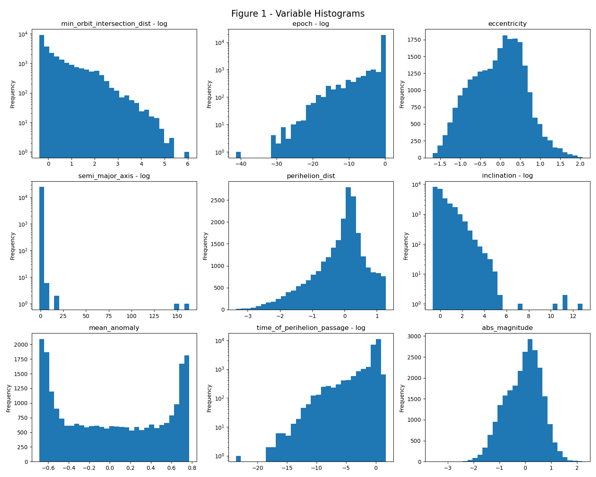
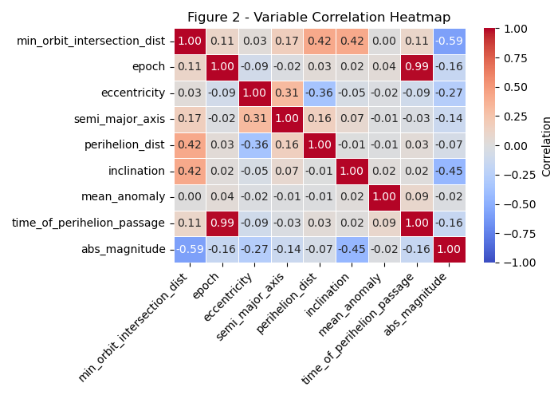
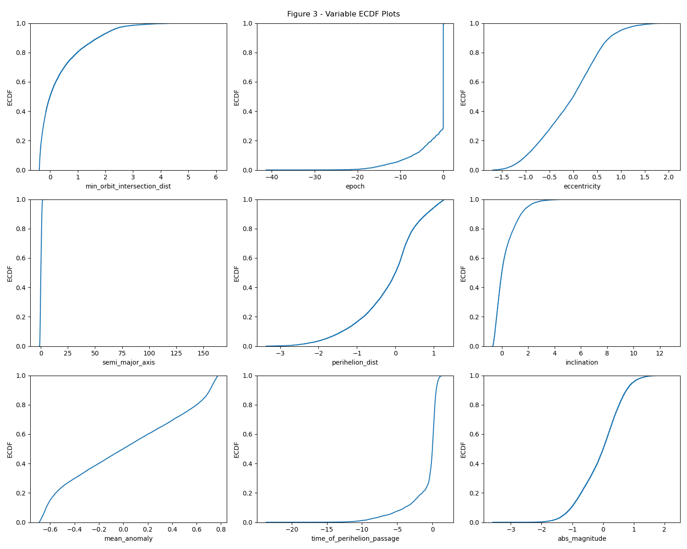
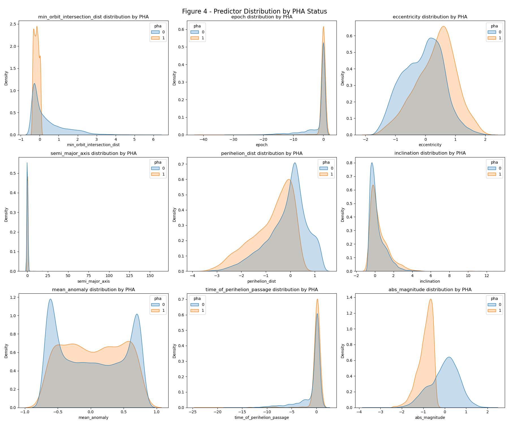
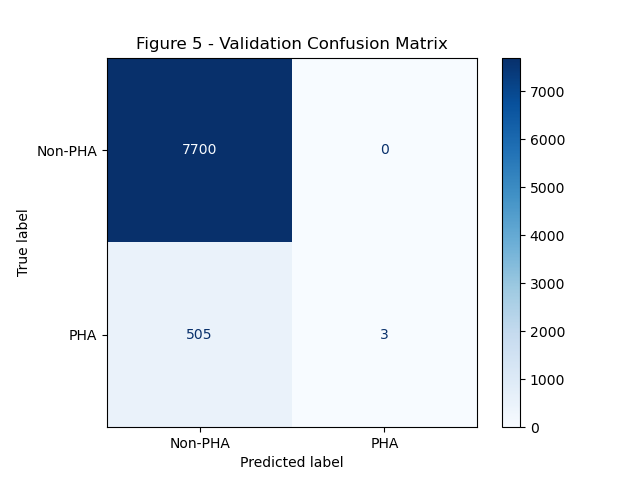
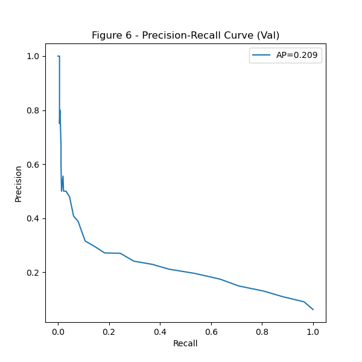
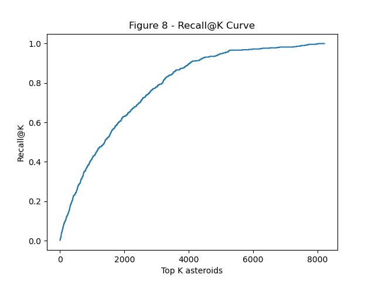
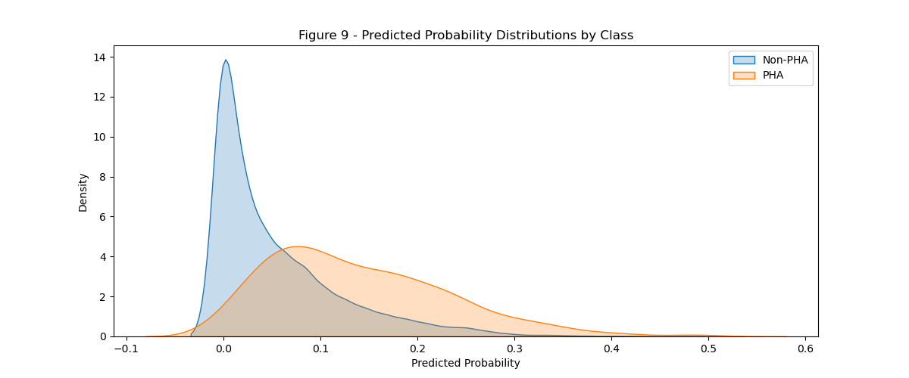

```{python}
import ast
from pathlib import Path

import pandas as pd

raw_df = pd.read_csv("data/raw/asteroid_data_raw.csv")
clean_df = pd.read_csv("data/clean/asteroid_data_clean.csv")
train_df = pd.read_csv("data/processed/asteroid_train.csv")
val_df = pd.read_csv("data/processed/asteroid_val.csv")
test_df = pd.read_csv("data/processed/asteroid_test.csv")

n_records = len(raw_df)
n_asteroids, n_variables = clean_df.shape
pha_counts = clean_df["pha"].value_counts().sort_index()
missing_abs_magnitude = int(raw_df["H"].isna().sum())
rows_before_drop = len(raw_df.dropna(subset=["pha"]))

best_params = ast.literal_eval(Path("results/tables/best_params.txt").read_text().strip())
best_model_results = pd.DataFrame(
    [(key.replace("knn__", ""), value) for key, value in best_params.items()],
    columns=["Hyperparameter", "Selected Value"],
)

threshold_lines = Path("results/tables/best_threshold.txt").read_text().strip().splitlines()
threshold_map = dict(line.split("=", 1) for line in threshold_lines)
best_thresh = float(threshold_map["best_threshold"])
min_precision = float(threshold_map["min_precision"])

val_metrics = pd.read_fwf("results/tables/validation_metrics.txt", skiprows=2)
test_metrics = pd.read_fwf("results/tables/test_metrics.txt", skiprows=2)

val_auc = float(Path("results/tables/validation_metrics.txt").read_text().splitlines()[0].split(":")[1].strip())
test_auc = float(Path("results/tables/test_metrics.txt").read_text().splitlines()[0].split(":")[1].strip())

val_pha = val_metrics[val_metrics.iloc[:, 0].astype(str) == "1"].iloc[0]
test_pha = test_metrics[test_metrics.iloc[:, 0].astype(str) == "1"].iloc[0]

train_n = len(train_df)
val_n = len(val_df)
test_n = len(test_df)
selected_feature_count = train_df.shape[1] - 1

variables_df = pd.DataFrame({
    "Variable": ["spkid", "full_name", "pdes", "orbit_id", "pha", "moid_ld", "epoch", "e", "a", "q", "i", "ma", "tp", "H"],
    "Type": ["int64", "str", "str", "str", "int64", "float64", "float64", "float64", "float64", "float64", "float64", "float64", "float64", "float64"],
    "Description": [
        "Object primary ID",
        "Object full name/designation",
        "Object primary designation",
        "Orbit solution ID",
        "Potentially hazardous asteroid flag (target), 1 indicates PHA, 0 indicates not PHA",
        "Earth minimum orbit intersection distance, renamed to `min_orbit_intersection_dist`",
        "Epoch of osculation in Julian day form",
        "Eccentricity, renamed to `eccentricity`",
        "Semi-major axis, renamed to `semi_major_axis`",
        "Perihelion distance, renamed to `perihelion_dist`",
        "Inclination (angle w.r.t. the x-y ecliptic plane), renamed to `inclination`",
        "Mean anomaly in degrees, renamed to `mean_anomaly`",
        "Time of perihelion passage, renamed to `time_of_perihelion_passsage`",
        "Absolute magnitude parameter, renamed to `abs_magnitude`"
    ]
})
```

## Summary

The main goal of this project is to build a predictive model that classifies near-earth objects as potentially hazardous, specifically aiming to see if additional orbital and physical characteristics are associated with such prediction. This is important because it allows planetary defense to detect potential risks before intervention is too late. Methodologically, we perform K-Nearest Neighbors using `{python} selected_feature_count` orbital and physical variables from NASA JPL's Small-Body DataBase as predictors and focusing on the target binary variable `pha` (potentially hazardous asteroid) for classification. Additionally, we tune the model using cross-validation and evaluate its performance through ROC-AUC, Precision-Recall curves, confusion matrices, and threshold tuning. Finally, it's worth noting that NASA's Small-Body DataBase contains a significant class imbalance between non- and potentially hazardous asteroids, leading us to ultimately prioritize recall and reduce false negatives.

## Introduction

**Background**
Astronomers monitor and identify asteroids as a means to classify those that may pose a threat to Earth and humanity. Specifically, near-earth asteroids (NEAs), those whose orbits bring them relatively close to Earth, are a primary focus of this monitoring. While most are harmless, some of these asteroids are referred to as potentially hazardous (PHAs), as certain characteristics (such as an asteroid's minimum orbit intersection distance with Earth and its size) determine an asteroid's potential risk of impact. This classification of PHAs is valuable for both planetary science and defense, since even small asteroids can cause serious harm if they entered into our atmosphere.

**Question**
Can orbital and physical characteristics of near-Earth asteroids be used to accurately predict whether an asteroid is classified as potentially hazardous?

**Dataset**
This project uses the Small-Body DataBase (SBDB) from NASA JPL [@nasa_sbdb]. Specifically, we use only near-earth asteroids rather than all objects for speed and efficiency. Variables were chosen based on available data, i.e., if a significant percentage of a variable was missing for the defined scope (near-earth asteroids), the variable was not included in the API call. The dataset retrieved from the API contains the following variables in @tbl-variables.

```{python}
#| label: tbl-variables
#| tbl-cap: "Variables retrieved from the NASA JPL SBDB Query API."
variables_df
```

## Methods & results

### Imports and setup

We import the `requests` library to pull data from NASA's API, `pandas` and `numpy` for data wrangling, `matplotlib` and `seaborn` for visualization, and `scikit-learn` for training our KNN model. We also set a fixed random seed to ensure all work is reproducible.

### Fetch data

In order to conduct our analysis, we must first retrieve data on near-earth asteroids directly from NASA JPL's SBDB Query API. Ensuring that only near-earth objects are included, we state that `sb-group="neo"` and request variables such as eccentricity, inclination, and absolute magnitude. Finally, we convert the JSON output into a DataFrame, saving it to `data/raw/asteroid_data_raw.csv` and preserving the original dataset for further analysis.

Notably, the resulting dataset contains `{python} n_records` records.

### Clean data

To clean our raw data in preparation for classification, we first recode the abbreviated API variable names into more descriptive column names, not only enhancing readability but also allowing for a more transparent workflow. We then recode the target variable `pha` by removing rows containing missing values and converting the remaining values to binary for simplicity. Additionally, we standardize asteroid names by removing parentheses and replacing spaces with underscores to ensure consistency. Now, checking for missing values across all other variables, we drop the few rows that contain missing values for absolute magnitude (being that this is the only column actually containing NA-values) and save the cleaned dataset to `data/processed/asteroid_data_clean.csv`.

Not significant missing data remained after collection. We therefore dropped the rows missing `abs_magnitude`, which affected only `{python} missing_abs_magnitude` out of `{python} rows_before_drop` observations.

### Exploratory data analysis

#### Dataset Overview

Having loaded our cleaned dataset, we note that our analysis will be working with `{python} n_asteroids` near-earth objects, each containing `{python} n_variables` descriptive variables.

Here, the summary statistics provide a general sense of the typical ranges and variability for each column. This aids our understanding of potential skewness and may be important when identifying transformations later.

Notably, our target variable `pha` shows a distinct class imbalance, containing far more non-hazardous near-earth asteroids than potentially hazardous ones (`{python} int(pha_counts[0])` compared to `{python} int(pha_counts[1])`). While this pattern is expected, it will be important when evaluating our model performance later.

#### Univariate Distributions

To better understand each distinct variable's role in the dataset, we plot their individual histograms and analyze their spread, shape, and skew. However, since several of these variables span large ranges, we apply log transforms where necessary.

{#fig-histogram width=85%}

Here, @fig-histogram shows that various predictors are asymmetrically distributed with the majority of observations being higher in value (`epoch`, `perihelion_dist`, and `time_of_perihelion_passage`), while variables like `inclination` and `min_orbit_intersection_dist` show frequencies decreasing as values increase. Conversely, `eccentricity` somewhat resembles that of a bell-curved distribution, indicating a balanced central tendency. Finally, `mean_anomaly` appears somewhat bimodal, showing higher frequencies near both ends of its range, while `semi_major_axis` contains most of its values near zero with very few outliers extending outward.

#### Multivariate

Now, wanting to better understand the individual relationships between our numerical predictors, we plot a correlation heat map (@fig-heatmap), allowing us to explore patterns and potential dependencies.

{#fig-heatmap width=75%}

We see a significant correlation between `epoch` and `time_of_perihelion_passage`. Consider that `epoch` indicates the epoch of osculation in Julian day form. Then, this correlation makes sense and is expected given that perihelion time ($T_p$) is related to epoch by:

$$
T_p \approx \text{epoch} - \text{fraction of orbital period}
$$

Perihelion passage is within one orbital period of the epoch which creates a near-linear relationship, and is thus reflected in a highly linear correlation. In other words, these two variables are not independent measurements but rather computed relative to the other, i.e., a spurious correlation.

When modeling, we will not use both variables as features.

#### Outliers

Outliers may not necessarily indicate statistical noise in this dataset, but could rather indicate rare phenomena. We thus examine outliers via both statistical methods and visual methods.

There are quite a lot of outliers flagged by IQR. However, this is expected given that IQR assumes a roughly symmetric distribution. In the histograms plotted earlier, we observed long tails, multiple peaks, and skewed distributions.

We use Empirical Cumulative Distribution Function (ECDF) plots to visualize the distribution with every data point, and no binning or smoothing [@seaborn_ecdf].

{#fig-ecdf width=85%}

Outliers are expected given the particular domain and variables. Particuarly, since `epoch` values are reference times, rather than physical variables, this is expected. This stands for `time_of_perihelion_passage` as well. For `semi_major_axis`, this also makes sense given the different orbital populations that are present, e.g., near-earth and main belt. Additionally, the outliers in `min_orbit_intersection_dist` could indicate meaning rather than noise such that low MOID signifies hazardous objects, making this variable likely a strong feature to use when modeling.

#### Initial Feature Selection

We use robust scaling and kernel density estimation (KDE) plots to investigate structure for potential feature variables compared to the target variable (PHA).

{#fig-kde width=90%}

From these KDE plots (@fig-kde), we can see that the absolute magnitude and MOID features may be strong features for prediction, given that both demonstrate significant peaks for PHA=1 compared to PHA=0. To a lesser extent, eccentricity demonstrates this as well. Conversely, inclination and perihelion distance have higher peaks for PHA=0 compared to PHA=1. Mean anomaly may be another feature to use, given that PHA=0 shows a strong multimodal distribution compared to PHA=1. Semi-major axis may be a feature to drop given the significant overlap between classes.

Additionally, given that an asteroid is typically classified deterministically as potentially hazardous via MOID and absolute magnitude, we do not use these features. In other words, we examine if there are other possible features that are associated with PHA classification.

### Data Preprocessing

Split into train (60%), validation (20%), and test sets (20%).

This preprocessing yields `{python} train_n` training observations, `{python} val_n` validation observations, and `{python} test_n` test observations across `{python} selected_feature_count` modeled features.

### Binary Classification

To predict whether a near-earth object is a potentially hazardous asteroid (PHA), we use binary classification. Given the constraint of using methods presented in DSCI 100, we use a KNN classifier with `sklearn` [@sklearn_knn], the only classification method discussed in the course.

We use a pipeline to robust scale the data and model with the KNN classifier, and use random search 5-fold cross validation to tune parameters.

These parameters are expected given this dataset. The selected distance metric was `{python} best_params['knn__metric']`, with `p = {python} best_params['knn__p']`, which is consistent with a setting where predictors may vary in scale and shape across dimensions.

The tuned neighborhood size was `k = {python} best_params['knn__n_neighbors']`, which smooths the decision boundary and reduces sensitivity to local noise.

```{python}
#| label: tbl-best-params
#| tbl-cap: "Best hyperparameter settings saved by the training script."
best_model_results
```

We note that the CV AUC is significantly worse when dropping MOID and absolute magnitude, which clearly makes sense given that these two features are typically used to flag/label asteroids as potentially hazardous, i.e., they are direct attributes such that predicting PHA using these attributes is in effect redundant.

### Results and Visualization

#### Validation Evaluation

We can see that with the default classification threshold, precision is `{python} round(float(val_pha["precision"]), 2)` and recall is `{python} round(float(val_pha["recall"]), 2)` for asteroids considered potentially hazardous. This makes sense, given that 1) there is significant class imbalance, and 2) we dropped MOID and absolute magnitude which are used to label PHAs. Since PHA=1 is a rare event, we will tune the threshold to maximize recall before evaluating on the test set.

{#fig-val-confmat width=55%}

Examining the confusion matrix on the validation set (@fig-val-confmat), we see that there are very few true positives and many false negatives. This pattern strengthens the argument that we must adjust the decision threshold and prioritize recall so as not to miss hazardous asteroids.

{#fig-val-pr width=55%}

The precision-recall curve (@fig-val-pr) clearly reflects that the model tends to perform generally poorly with a validation AUC of `{python} round(val_auc, 3)`, suggesting that the model does not do well when distinguishing between hazardous and non-hazardous asteroids.

#### Threshold Tuning

Using the saved threshold-selection rule, the selected decision threshold was approximately `{python} round(best_thresh, 3)`, with a minimum precision target of `{python} min_precision`. This threshold is intended to classify more asteroids as hazardous and improve recall, while still reflecting the practical limits of model performance on this validation set.

#### Test Evaluation

Now we see better precision on the test set after using the tuned threshold. However, recall and F1-score remain poor for PHA=1 samples, with precision `{python} round(float(test_pha["precision"]), 2)`, recall `{python} round(float(test_pha["recall"]), 2)`, and F1-score `{python} round(float(test_pha["f1-score"]), 2)`. Again, this makes sense given that we dropped MOID and absolute magnitude. This also shows that other features are associated with PHA classification to some extent, albeit marginally.

{#fig-test-confmat width=55%}

Having tuned the threshold, the updated confusion matrix (@fig-test-confmat) on the test set shows only slight improvement, although the gain is modest. It does indicate some improvement in the model's ability to identify potentially hazardous asteroids with these features.

Next, we examine the Recall@K curve. This will illustrate how many PHAs are detected when considering the top $k$ highest-risk asteroids.

{#fig-recall-at-k width=60%}

The relatively smooth curve (@fig-recall-at-k) indicates that the model is not very good at prioritizing risky objects first.

Finally, we examine at the probability distributions for each class (non-PHA vs PHA) to better understand how well the model separates the two.

{#fig-prob-dist width=75%}

We can see fairly clear separation between classes (@fig-prob-dist). Examining the decision boundary, we see the same result.

## Discussion

Given additional orbital and physical characteristics, we aimed to predict whether these features were associated with whether near-earth asteroids should be considered potentially hazardous, training a KNN classifier with `pha` as the target variable and tuning it using 5-fold cross validation. The resulting model performed relatively poorly overall, with an achieved test-set ROC-AUC of `{python} round(test_auc, 3)` and a test-set recall of `{python} round(float(test_pha["recall"]), 2)` for hazardous asteroids. In other words, given the class imbalance such that PHAs are a rare event, as well as the use of features that exclude MOID and absolute magnitude, the model had difficulty accurately classifying PHAs. This could also reflect the relatively small feature set, since we modeled only `{python} selected_feature_count` features. Such misclassification of potentially hazardous asteroids could be detrimental in a real-world setting, as failing to identify a PHA before it is too late risks severe consequences.

Overall, because KNN is a relatively simple algorithm, we did not expect our final model to perfectly capture the complex relationships when it comes to asteroid characteristics. It's possible that using more advanced models, particularly those designed to handle class imbalances, could improve our detection of hazardous asteroids. Further, given that examining feature importances is out of scope for this project (given the constraint of methods presented in DSCI 100), we are unable to explore whether some of these orbital and physical characteristics are better predictors of a PHA than others that could perhaps be used to label PHAs alongside MOID and absolute magnitude. Future work should do so in order to more appropriately answer the question of if additional orbital and physical characteristics are associated with predicting whether near-earth asteroids are potentially hazardous.

## References

::: {#refs}
:::
